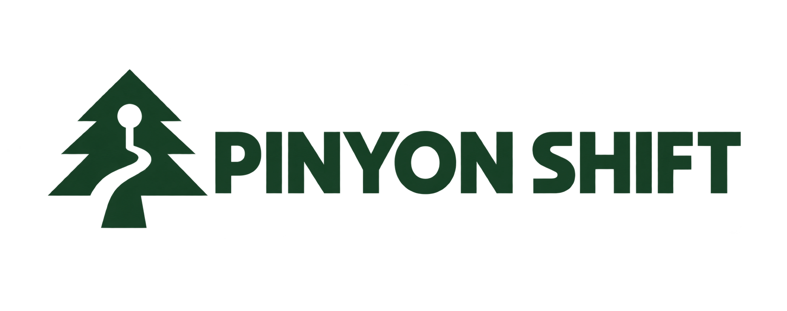

# Pinyon Shift

<p align="center">
  
</p>

<p align="center">
  <b>The Xbox 360 release of <i>Forza Horizon</i>, recompiled to run natively on Windows.</b><br>
  Built on your own PC from your own disc. 120 fps at 1x, internal resolutions up to 4K.
</p>

Pinyon Shift is not an emulator. The game's PowerPC code is translated ahead of
time into C++ with [ShiftGlue](https://github.com/arcanite24/shiftglue-sdk), our
fork of ReXGlue, and compiled for x86-64 on your computer. The GPU command stream
the game builds is executed by a native renderer written for *Forza Horizon*,
on Vulkan (the default) or Direct3D 12. The project is a playable preview: early,
imperfect, and surprisingly drivable.

This repository contains the launcher, build tools, host code, configuration and
the pinned ShiftGlue submodule needed to create the preview on your own
computer. It does **not** contain the game, game assets, generated translations
or a prebuilt game executable.

> **Preview.** Rendering regressions, accelerated crowd animations at high frame
> rates, and slowdowns in some areas remain possible. See the latest
> [preview release notes](docs/releases/0.2.0-preview.3.md) for what the last
> published build contains.

## Highlights

- **Native code.** The title's executable is recompiled ahead of time; nothing
  is interpreted or JIT-compiled at run time.
- **A renderer built for this game.** Every draw, clear, resolve and swap runs
  in order with the game's own shaders, translated to SPIR-V (Vulkan) or DXBC
  (Direct3D 12). On Vulkan, one thread decodes the game's command stream while a
  second records the draws.
- **60 and 120 fps at the right game speed.** The render rate is decoupled from
  the console's 30 fps, with the simulation kept in step.
- **1x to 4x internal resolution**, FSR 1 output scaling, anisotropic and
  trilinear filtering, FXAA, and optional motion blur and depth of field.
- **Settings in game (F6)** for display, graphics, audio and controls, plus a
  trainer, photo export, save backups and [mods](docs/MODDING.md).

## Performance

Measured on 2026-09-30 on one machine: AMD Ryzen 7 5800X (8 cores),
128 GB RAM, NVIDIA GeForce RTX 4080 (driver 581.08), Windows 11 Pro 26200,
3840×2160 display at 120 Hz.

### Against Xenia and the old Xenos renderer

The same scene on all four, from a new profile: the game's opening intro
cinematic and the start of the opening drive in the Viper. The internal
resolution is 1x (1280×720) and every program runs in a window at its default
settings.

| Program | Intro cinematic | Opening drive |
| --- | ---: | ---: |
| Xenia Canary (`67d80958c`, Direct3D 12) | 30.0 fps | 30.0 fps |
| Pinyon Shift 0.1.0 (ReXGlue Xenos renderer) | 28.3 fps | 29.0 fps |
| Pinyon Shift, native renderer on Direct3D 12 | 118.7 fps | 119.5 fps |
| **Pinyon Shift, native renderer on Vulkan** | **119.8 fps** | **120.0 fps** |

On the console *Forza Horizon* runs at 30 fps, and Xenia and the Xenos-era
build keep that cap. The native renderer renders at up to the display's
refresh rate, here 120 Hz, which caps both native rows. The race below shows how
much headroom is left.

<details>
<summary>How these were measured</summary>

Each program started FH1 from a fresh profile and was driven by the same
script: A was pressed every five seconds, as the repository's
`fh1-opening-sync` route does. Xenia got the key as real input while its window
was in the foreground; the others got it posted to their window. Each target had
a warm-up run first, and the measured run started from a fresh profile again
with only the shader and pipeline caches kept.

- **Windows.** The intro cinematic is 105–165 s after launch and the opening
  drive 185–240 s, on all four (checked in window captures every 15 s).
- **Xenia and the 0.1.0 build.** Frames are counted on screen with DXGI Desktop
  Duplication, and only frames whose image changed count, since Xenia presents
  the same image several times. Averages are over one-second counts; the worst
  second was 29 fps for Xenia and 21 fps for the 0.1.0 build.
- **Native rows.** These are the game's own frame log. The same on-screen count
  gives 109.5/119.6 fps on Direct3D 12 and 116.1/118.2 fps on Vulkan, slightly
  lower because consecutive frames sometimes look alike.
- **Xenia with vsync off.** Xenia then shows about 125 distinct frames a
  second, but its emulated vblank is no longer synchronized and the game's clock
  runs fast: it reached the drive about 25 s early. Those runs are not in the
  table.

</details>

### The race, native renderer

The scripted race (`fh1-race-sync`) is the heaviest route. It is measured over
the race's last 600 frames with the frame rate limited to 120, in a hidden
window, from the same save.

| Internal resolution | Vulkan | Direct3D 12 |
| --- | ---: | ---: |
| 1x (1280×720) | **110 fps** (9.1 ms) | 79 fps (12.7 ms) |
| 2x (2560×1440) | **79 fps** (12.7 ms) | 66 fps (15.2 ms) |
| 3x (3840×2160) | 35 fps (28.7 ms) | **57 fps** (17.5 ms) |

Median frame rate and frame time over the race's last 600 frames, its busiest
part. At 1x on Vulkan the first 40 seconds of the race hold 120 fps (8.3 ms).

Vulkan is the default because it records draws on a second thread, which is
what reaches 120 fps at 1x. At 3x and above the GPU is the limit, and there
Direct3D 12 is faster: the Vulkan backend spends more GPU time on the game's
multisampled surfaces. The optional single-sampled surfaces
(`fh1_scaled_msaa_single_sample`) bring Vulkan at 3x to about 24 ms. How the
Vulkan path got here is in the [performance backlog](docs/PERFORMANCE_BACKLOG.md).

## Play

1. Download `PinyonShift-Launcher.zip` from the latest release.
2. Extract the two files to a folder and run `PinyonShift.Launcher.exe`.
3. Drop the ISO you personally dumped from a supported original disc onto the
   launcher, or choose it with **Choose ISO**.
4. Confirm ownership, then choose **Verify & Build**.
5. Leave the launcher open while it installs the Windows build tools and builds
   the preview. The first build can take 20–60 minutes and needs roughly 25 GB of
   free disk space.
6. Choose **Play Pinyon Shift**. Press **F6** in game for settings.

**Graphics** in the launcher picks the graphics API (Vulkan, recommended, or
Direct3D 12) and the internal resolution before the game starts. On Vulkan 1x
runs at up to 120 fps and 2x above 60; for 3x and 4x choose Direct3D 12, which
prepares shader packs for your computer before its first start. Everything else, including the
**Performance 120** and **Quality 60** presets, is in the in-game settings.

The preview launcher is not code-signed yet, so Windows may identify it as an
unrecognized app. Use only the archive attached to this repository's release
and verify its published SHA-256.

The launcher verifies the image before reading it. Unsupported or modified
images are rejected. Your image and extracted game files stay on your machine.
The launcher downloads build tools and the pinned ShiftGlue source, extracts
the disc locally, generates the translation locally and compiles the executable
locally. Administrator permission is requested only if Visual Studio Build Tools
must be installed.

To build on another drive, use **Change folder** under **Local build** in the
packaged launcher. The launcher remembers your choice for subsequent launches.
This selects an installation; it does not move an existing installation or save.
You can also override the remembered location from PowerShell:

```powershell
$env:PINYON_SHIFT_INSTALL_ROOT = 'D:\Games\PinyonShift'
.\PinyonShiftLauncher.exe
```

Source, downloaded tools, extracted game data and the default save and cache
tree live beneath that folder. Existing installations and saves are not moved;
an existing `PINYON_SHIFT_STATE_ROOT` override still takes precedence for saves
and caches. Launchers inside a repository checkout continue to use that
checkout. This is a custom build location, not a portable binary distribution:
Microsoft Build Tools still need system-drive space, and generated CMake paths
are tied to the build location.

If setup fails, `.local/logs/setup-error.json` includes the failed command's
exit code, build-log path and last 80 output lines. The complete configure and
build logs are in the same folder. Include the first actual compiler or CMake
error when reporting a failure; the final "build failed" line alone cannot
identify it.

### Requirements

- The USA retail base disc, serial `MS-2505`, title ID `4D5309C9`.
- Windows 10 or 11, x64.
- A GPU with Vulkan 1.3 (the default) or Direct3D 12. Only NVIDIA GPUs are
  qualified so far; AMD and Intel are untested.

This is a public preview, not a finished remaster. Please report reproducible
problems with the issue template and do not attach game files or generated
code.

## Reporting crashes and bugs

Keep the launcher open while playing. If the game exits unexpectedly, the
launcher catches the exit, creates a sanitized diagnostic ZIP, and offers one
button to open a prefilled GitHub issue with that ZIP selected in Explorer.
Attach the selected ZIP and add the shortest reliable reproduction steps.

The public report includes build hashes, a stable crash ID, exception details,
the end of the runtime log, runtime settings, Windows build, CPU, GPU and driver
versions. It excludes the game, saves, generated code, input capture, local
paths and memory dumps. A fuller dump stays on the player's computer and should
only be shared privately if a maintainer requests it. Non-crash bugs can be
reported with **Report a problem** in the launcher.

## Build from source

From a PowerShell terminal in a repository checkout:

```powershell
.\tools\setup-preview.ps1 -IsoPath C:\path\to\your-disc.iso
.\tools\launch-preview.ps1
```

The setup script provisions pinned dependencies, initializes ShiftGlue,
verifies and extracts the disc, generates translated source, and builds Release
with both the Vulkan and the Direct3D 12 backends.
`python tools/pinyon.py launch` starts the built game the same way without
PowerShell, with `--state-root`, `--hidden` and game arguments after `--`; it is
the launcher for Linux builds. See [Building](docs/BUILDING.md) and
[Troubleshooting](docs/TROUBLESHOOTING.md) for details.

## Roadmap

Longer-term direction, in no particular order. The ordered plan, with vertical
slices, sizes, dependencies and acceptance gates, is the
[native port backlog](docs/NATIVE_PORT_BACKLOG.md); renderer performance work is
in the [performance backlog](docs/PERFORMANCE_BACKLOG.md).

- [ ] Lower the hardware requirements and qualify AMD and Intel GPUs
- [ ] Fix the remaining rendering regressions
- [ ] Keep crowd and purchase animations at the right speed above 30 fps
- [ ] Make the first build faster and fully validated
- [ ] Support more disc regions and languages
- [ ] Change resolution and render scale while the game is running
- [ ] Apply graphics settings without restarting the preview
- [ ] Support ultrawide (21:9 and wider) displays
- [ ] Ship the UI extension API
- [ ] Ship a modding API for loading custom content
- [ ] Build for macOS and Linux
- [ ] Port the runtime to Android
- [ ] Ship a Steam Deck build
- [ ] Support portable installs
- [ ] Sign the launcher and preview executables
- [ ] Import cars from *Forza Horizon 2*

Measured findings and validation rules are in
[development findings and priorities](docs/DEVELOPMENT.md).

## Project boundaries

Only independently authored project files are licensed under the
[BSD 3-Clause License](LICENSE). Microsoft, Xbox, Turn 10 Studios, Playground
Games, *Forza Horizon*, and third-party dependencies remain the property of
their respective owners. Pinyon Shift is not affiliated with or endorsed by
them. See [Legal and distribution](docs/LEGAL.md) and
[Third-party notices](THIRD_PARTY_NOTICES.md).

## Contributing

Start with [CONTRIBUTING.md](CONTRIBUTING.md). Repository checks reject disc
images, executables, generated translations, extracted assets, build products,
and other machine-local material.

## Supporting the project

Pinyon Shift is and will remain free. If you would like to support its continued
development, you can [sponsor arcanite24 on GitHub]. Sponsorship is entirely
optional and does not provide builds, game content, support, or influence over
the project roadmap.

[sponsor arcanite24 on GitHub]: https://github.com/sponsors/arcanite24
